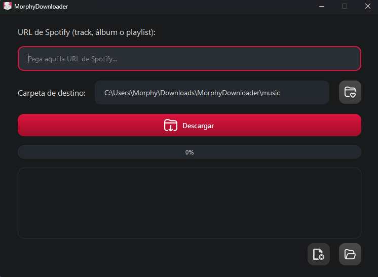
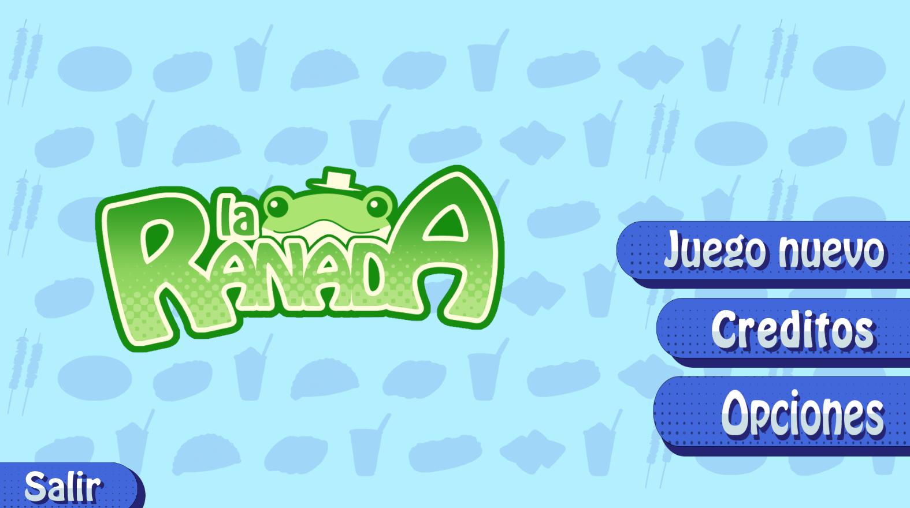
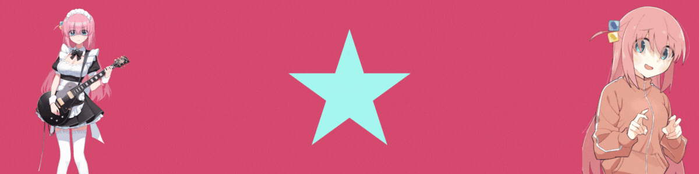

<!-- Banner de Bienvenida -->

    

## 💭 Just me

<table>
<tr>
<td width="60%" valign="top">

I love playing with different programming tools and seeing how my ideas come to life. Most of the time, I'm experimenting with Unity or building little programs that make my life easier.  
I'm studying Computer Science Engineering and always try to give a little extra in everything I do.  
💡 Fun fact: I code better when I have chocolate at hand.

</td>
<td width="40%" align="center" valign="middle">

</td>
</tr>
</table>

## 🛠️ Languages and Tools

    

## 📈 GitHub Stats

<table align="center">
  <tr>
    <td align="center">
      
    </td>
    <td align="center">
      
    </td>
  </tr>
</table>

    

## 🚀 Projects

<table>
<tr>
<td width="50%">
<h3 align="center">Morphy Downloader</h3>

  

 

</td>
<td width="50%">
<h3 align="center">Ranada Game</h3>

 

</td>
</tr>
</table>

## 📫 Contact Information

    
    
    
    
    
    

<!-- Banner de Despedida -->

    

