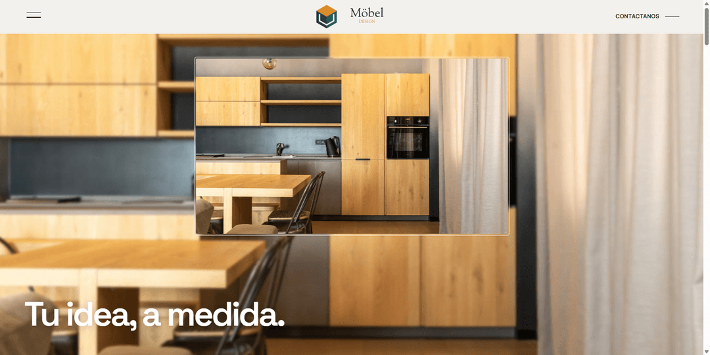
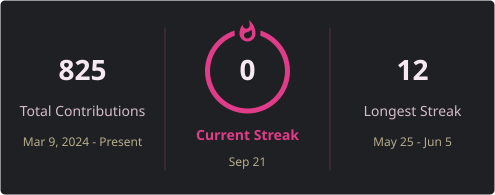

<!-- Welcome banner -->

  

<h1 align="center">Hi, I'm Esteban — Morphy online.</h1>

  <strong>Junior Full Stack &amp; Android Developer</strong> 
  I build accessible web products and local-first mobile apps with an emphasis on clear architecture, performance, and maintainable code.

  <a href="https://www.mrmorphy.com/">Portfolio</a>
  · <a href="https://www.linkedin.com/in/esteban-onate/">LinkedIn</a>
  · <a href="./assets/files/CV_Esteban_Onate.pdf">Résumé</a>
  · <a href="mailto:esteban.onate137@proton.me">Email</a>

  Based in Valparaíso, Chile · Open to junior opportunities, collaboration, and product-focused work

## Just me

<table>
  <tr>
    <td width="72%" valign="top">
      

        I am a Computer Civil Engineering student at the University of Valparaíso, focused on native Android and full-stack development. I enjoy taking products from an initial problem to a usable release: shaping the interface, defining technical boundaries, validating behavior, and documenting the decisions behind it.
      

      

        My current work ranges from <strong>Kotlin and Jetpack Compose</strong> applications to <strong>React, Next.js, and TypeScript</strong> projects for real users and clients. I use AI-assisted and spec-driven workflows to research and iterate faster, but I only ship solutions I can understand, review, and maintain myself.
      

      

        Away from product work, I like experimenting with Unity, game systems, visual design, and small tools that solve annoyingly specific problems.
      

    </td>
    <td width="28%" align="center" valign="middle">
      
    </td>
  </tr>
</table>

## Languages & tools

<strong>Web applications</strong>

  

<code>React 19</code> <code>Next.js</code> <code>TypeScript</code> <code>Node.js</code> <code>REST APIs</code> <code>Playwright</code>

<strong>Native Android</strong>

  

<code>Jetpack Compose</code> <code>Material 3</code> <code>Room</code> <code>DataStore</code> <code>Coroutines</code> <code>Flow</code> <code>Readium</code>

<strong>Data, quality & delivery</strong>

  

<code>SQL</code> <code>CI/CD</code> <code>GitHub Actions</code> <code>ESLint</code> <code>Google Play Console</code>

  
<strong>Also in my toolbox</strong>

   
  

    
  

  
<code>C#</code> <code>Unity</code> <code>FMOD</code> <code>Python</code> <code>Figma</code>

## Selected work

### Bunkora · Native Android / local-first

A local-first Android library and reader for CBZ, CBR, EPUB, and PDF files. Bunkora keeps reading available without an account or connection while supporting collections, tags, search, persistent progress, specialized readers, and optional Google Drive backups.

**Engineering:** layered `ui/domain/data` architecture, MVVM/UDF, Storage Access Framework without broad storage permissions, Room, DataStore, Coroutines, Flow, Readium, and format-specific reading pipelines.

**Kotlin** · **Jetpack Compose** · **Material 3** · **Room** · **Readium** · **Coroutines**

[Google Play](https://play.google.com/store/apps/details?id=com.mrmorphy.bunkora) · [Engineering showcase](https://github.com/Morphy137/BunkoraShowcase) · [Project details](https://www.mrmorphy.com/#projects)

 

### Möbel Design Web · Business website / production

A production website for a custom furniture company in Valparaíso. The experience communicates the company's process and approach to materials, then turns each inquiry into a structured WhatsApp message without storing personal data or adding unnecessary infrastructure.

**Engineering:** static App Router architecture, responsive image delivery, accessible interactions, technical SEO, reduced-motion support, continuous integration, and end-to-end coverage for desktop and mobile flows.

**Next.js 16** · **React 19** · **TypeScript** · **Tailwind CSS 4** · **Motion** · **Playwright**

[Visit the website](https://mobeldesignconstruction.vercel.app/) · [Public technical template](https://github.com/Morphy137/furniture-landing-template) · [Project details](https://www.mrmorphy.com/#projects)

## Development rhythm

  

  Generated daily from GitHub contribution data · Times evaluated in America/Santiago

## Let's connect

  I am open to junior Android, frontend, and full-stack opportunities where I can contribute to real products while continuing to grow through practical engineering work.

  <a href="https://www.mrmorphy.com/"><strong>mrmorphy.com</strong></a>
  · <a href="https://www.linkedin.com/in/esteban-onate/">LinkedIn</a>
  · <a href="mailto:esteban.onate137@proton.me">Email</a>
  · <a href="./assets/files/CV_Esteban_Onate.pdf">Résumé</a>
  · <a href="https://play.google.com/store/apps/details?id=com.mrmorphy.bunkora">Google Play</a>

<!-- Farewell banner -->

  

