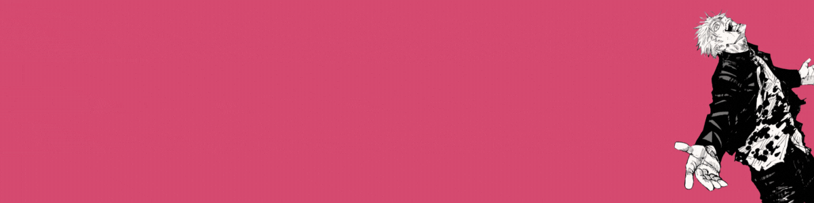

# 👋 ¡Hola! Soy Morphy137

<!-- Banner de Bienvenida -->

    

## 👨‍💻 Sobre mí

Me encanta jugar con diferentes herramientas de programación y ver cómo mis ideas cobran vida. La mayor parte del tiempo ando experimentando con Unity o armando programitas que me hagan la vida más fácil.

Estoy estudiando Ingeniería Civil Informática y siempre trato de dar un poquito más en lo que hago. Dato curioso: programo mejor cuando tengo chocolate a mano.

 
## 🛠️ Tecnologías & Herramientas

    
    
    
    
    
    
    

## 📈 Estadísticas de GitHub

  
  

    

## 🚀 Proyectos Destacados

### 🎮 Juego de Ritmo

**Tecnologías:** Unity, C#, Pixel Art  
**Descripción:** Juego de ritmo 2D para GameJam  
[🎮 Jugar](https://github.com/Morphy137/RanadaProject) | [📱 Trailer](https://www.youtube.com/watch?v=dQw4w9WgXcQ)

<table>
<tr>
<td width="50%">
<h3 align="center">Morphy Downloader</h3>

  

 

</td>
<td width="50%">
<h3 align="center">Ranada Game</h3>

 

</td>
</tr>
</table>

## 📫 Información de Contacto

    
    
    
    

<!-- Banner de Despedida -->

    

